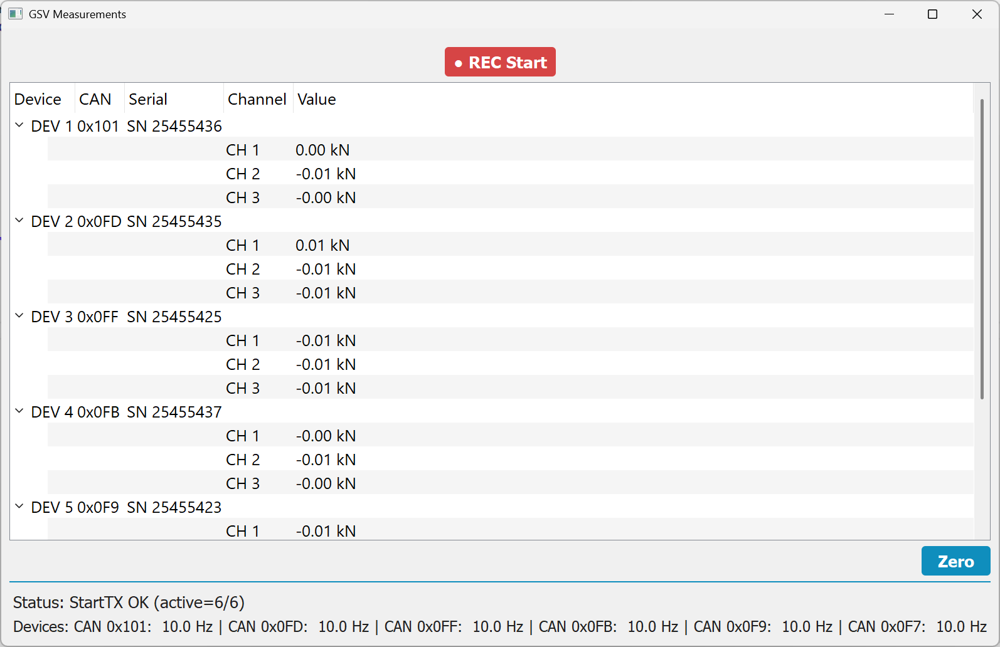

# 🔷 GSV86CAN Viewer – Tree View Measurement Monitor & Logger

## Overview

**GSV86CAN Viewer** is a lightweight Windows desktop application (Python / PyQt5) for monitoring and logging measurement data from GSV-6 / GSV-8 CAN-based measurement amplifiers.

The application:

* Communicates with one or more GSV devices over **CAN bus** using the vendor DLL
* Displays live measurement values in a **tree view** grouped by **Device → Channel**
* Supports **zeroing (tare)** of all devices
* Logs measurement data to **CSV or Excel (XLSX)** files
* Uses a **YAML configuration file** for CAN IDs and device options

The software is designed to be:

* Robust against missing or misconfigured devices
* Easily extensible (new devices, sensors, layouts)
* Clear and deterministic for experimental and test‑bench use

<p align="center">
  
</p>

---

## Installation

### 🔹 Recommended Method (Stable Version)

Download the latest stable version from the Releases page:

👉 https://github.com/me-systeme/GSV86CANViewer/releases

1. Open the page
2. Select the latest version (e.g. `v1.0.0`)
3. Download **Source code (zip)**
4. Extract and run

These versions are tested and considered stable.

---

### 🔹 Development Version (main branch)

Alternatively, you can use the latest development version:

```bash
git clone https://github.com/me-systeme/GSV86CANViewer.git
```

⚠️ Note:
The `main` branch may contain unfinished features or breaking changes.

---

### 🔹 Specific Version via Git

If you want to use a specific version:

```bash
git clone --branch v1.0.0 --single-branch https://github.com/me-systeme/GSV86CANViewer.git
```

---

## Versioning

This project follows [Semantic Versioning](https://semver.org/):

* `MAJOR` – incompatible changes
* `MINOR` – new features (backward-compatible)
* `PATCH` – bug fixes

Example:

* `1.0.0` → first stable release
* `1.1.0` → new feature
* `1.0.1` → bug fix

---


## ✨ Application Features

### 🌳 Live Tree View (Device → Channel → Value)

The main view shows a **tree list**:
  * one top-level entry per device (from `config.yaml`)
  * one child entry per device channel (channel count detected at runtime)
Each channel row displays:
  * Channel number (1-based)
  * Current measurement value (e.g. kN)
The device rows show:
  * Device number
  * Configured CAN Answer ID
  * Device-read CAN Value ID
  * Serial number (if readable)
Channel count is determined dynamically via `chan = gsv.activate(...)`.
You do **not** need to configure the channel count manually.

---

### 🔎 CAN ID Diagnostics

The device rows show both:

* the configured `answer_id` from `config.yaml`
* the device-read `value_id` from the DLL

This makes it easier to detect configuration mismatches such as:

* `value_id != answer_id`
* unexpected CAN device settings on the real hardware

This diagnostic display is read-only.
The Viewer does not modify CAN settings on devices.

---

### 🎨 Device Color Coding

* Devices with configuration or communication errors are highlighted in **red**.

This makes it easy to visually identify:

* Which devices failed to initialize correctly

---

### ⚖️ Zero / Tare Function

* A **"Zero" button** is available below the tree.
* When pressed, a confirmation dialog is shown.
* If confirmed, **all active devices are zeroed** via the DLL.

Technical notes:

* Zeroing is executed safely inside the acquisition thread
* The UI immediately updates values to zero for visual feedback

---

### ⏺️ Recording / Logging

If logging is enabled in the YAML file:

* A **REC button** is shown
* Recording can be started/stopped at runtime

Supported formats:

* `.csv` (streaming write)
* `.xlsx` (written when recording stops)

Features:

* Automatic filename increment (`data.xlsx → data_001.xlsx → data_002.xlsx`)
* User confirmation if a file already exists
* Configurable logging rate (e.g. 1 sample per second)

Notes:

* Logging rate is **independent** of the device measurement frequency.
* On startup, some channels may need a short time until they deliver their first value (depending on device streaming / CAN traffic).


### ⚠️ Logging Modes & Data Quality

The application supports two logging modes:

#### `strict_samples` (default-like behavior)

* Only values received during the logging interval are written

* Missing values remain empty

Additionally:

* A **live warning** is shown in the status bar if values are missing

* The warning disappears automatically once all channels deliver data again

✔ Best for:

* debugging CAN communication

* validating measurement timing

* detecting data loss

#### `hold_last`

* Missing values are filled using the last known value

* Produces fully populated tables

* May hide:

  * device dropouts

  * missing CAN messages

✔ Best for:

* long-term monitoring

* Excel-based workflows

### ⚠️ Important Note

* Logging rate (`rate_hz`) is independent of device frequency

* If `rate_hz` is too high compared to CAN traffic:

  → missing values will occur frequently

---

### 📡 Status & Device Information

At the bottom of the window:

* **Status line** shows initialization messages, warnings, and errors
* **Devices line** shows live update rates per CAN ID (Hz)

This helps diagnose:

* CAN communication issues
* Incorrect baud rates or IDs
* Mismatches between configured answer CAN ID and device-read value CAN ID
* Devices that stopped sending data

---

### 🧩 YAML Configuration File

All application behavior is controlled by `config.yaml`.
The configuration file controls:
* CAN baud rate and DLL buffer size
* Device CAN IDs (`cmd_id` / `answer_id`)
* Optional settings (frequency, scaling, sensor mapping)
* Logging

Note:
* `value_id` is not configured in `config.yaml`
* The Viewer reads the device-side `value_id` via the DLL for diagnostic display only

### ⚙️ 1. `dll`

```yaml
dll:
  mybuffersize: 300
  canbaud: 250000
```

| Key            | Description                             |
| -------------- | --------------------------------------- |
| `mybuffersize` | Internal DLL read buffer size           |
| `canbaud`      | CAN bus baud rate (must match hardware) |

---

### 💾 2. `logging`

```yaml
logging:
  file: "messdaten.xlsx"
  rate_hz: 1.0
```

| Key       | Description                                           |
| --------- | ----------------------------------------------------- |
| `file`    | Log file path (`.csv` or `.xlsx`). Empty = no logging |
| `rate_hz` | Logging rate in samples per second                    |

Notes:

* Logging is independent of device frequency
* Values are sampled from the latest available data

---

### 🔌 5. `devices`

```yaml
devices:
  frequency: 10
  load_default_settings: false
  auto_sensitivity_adjustment: false
  config:
    - dev_no: 1
      cmd_id: "0x0C8"
      answer_id: "0x0C9"
```

| Key                           | Description                                                  |
| ----------------------------- | ------------------------------------------------------------ |
| `frequency`                   | Global measurement frequency (Hz, ≤ 100 recommended)         |
| `load_default_settings`       | Loads factory defaults via DLL before reading ranges/scales. |   
| `auto_sensitivity_adjustment` | Automatically increases sensitivity of the devices           |
| `dev_no`                      | Logical device number                                        |
| `cmd_id`                      | CAN command ID                                               |
| `answer_id`                   | CAN answer ID                                                |

Per‑device frequency overrides are supported by setting `frequency` inside a device entry.

Notes:

* `answer_id` is configured in `config.yaml`
* `value_id` is not configured here
* The Viewer reads `value_id` from the device and shows it in the UI as diagnostic information

---

### 🧪 6. `sensors`

Defines physical sensor properties.

```yaml
sensors:
  - sensor_no: 1
    nominal_load: "250 kN"
    char_value: "3.15 mV/V"
```

Used to:

* Compute scaling factors
* Automatically adjust input ranges

---

### 7. `sensor_mapping`

Maps sensors to device channels.

```yaml
sensor_mapping:
  - sensor_no: 1
    channel: [1, 0]
```

Meaning:

* Sensor 1 is connected to device 1, channel 0

---

## 🚀 Getting Started

## 📦 Requirements

* **Windows** (DLL‑based)
* **Python 3.10+** 32 bit (recommended)
* Installed CAN hardware (PCAN)
* GSV CAN DLL (`GSV86CAN.dll`)

### Python Dependencies

Install required packages:

```bash
pip install PyQt5 pyyaml openpyxl
```

---

### Project Structure

```
project_root/
│
├─ config.yaml
├─ GSV86CAN.dll
├─ src/
│  └─ gsv86canviewer/
│     ├─ main.py
│     ├─ main_window.py
│     ├─ reader_thread.py
│     ├─ recorder.py
│     ├─ gsv86can.py
│     ├─ utils.py
│     └─ config.py
```

---

## ▶️ Running the Application

Start the application by running

```bash
python run.py
```

On startup:

1. Devices are activated (CAN IDs from config)
2. Channel count is detected automatically per device (`activate()` result)
3. Selected device metadata is read for diagnostics (e.g. serial number, CAN value ID)
4. Streaming starts and the tree view updates as values arrive

---

## 🧱 Building a Single-File Windows Executable (Onefile)

The application can be packaged into a single standalone `.exe` using PyInstaller.

### Characteristics

- The resulting executable is one single file
- The vendor DLL (`GSV86CAN.dll`) is embedded inside the executable
- At runtime, PyInstaller extracts the DLL to a temporary directory and loads it automatically
- The configuration file `config.yaml` remains external and must be located next to the `.exe`

### Build Command

Run the following command from the project root directory:

```
python -m PyInstaller --noconfirm --clean --windowed --onefile  --paths "src"  --add-binary "GSV86CAN.dll;."  run.py
```

### Resulting Files

After a successful build, the dist/ directory will contain:
```
dist/
└─ run.exe
```

To run the application, place config.yaml next to the executable:
```
run.exe
config.yaml
```

---

## Design Notes

* All DLL calls are isolated in `gsv86can.py`
* All hardware access runs in a **QThread** (no UI blocking)
* UI logic is strictly separated from acquisition logic
* YAML config is loaded once and treated as read‑only
* Channel structure is **not configured** manually:
  * devices from YAML
  * channels from `activate()`

---

## Usage

This application is intended for **engineering, laboratory, and test‑bench use**.

Ensure that:

* CAN IDs do not conflict with other devices
* Frequencies stay within device limits
* Zeroing is performed only under safe conditions

---

## ⚠️ CAN Bus Configuration & Safety

The GSV86CAN Viewer does **not configure CAN communication settings** of devices.

It assumes that all connected devices are already correctly configured and can safely operate together on the same CAN bus.

### Important Requirements

Before connecting multiple devices to the same CAN bus, ensure that:

* All CAN IDs are **globally unique**, especially:
  * `cmd_id`
  * `answer_id`
  * `value_id`
* No two devices transmit on the same CAN ID
* The CAN baud rate matches across all devices

⚠️ If multiple devices share the same `value_id`, **bus collisions will occur immediately**, even before the Viewer is started.

### Recommended Setup

It is strongly recommended to:

* Configure devices **individually or in isolation**
* Use a dedicated configuration tool (e.g. [StartupCAN](https://github.com/me-systeme/StartupCAN))
* Ensure:
  * `value_id = answer_id` (recommended practice)
  * All IDs are unique across the full system

### Role of the Viewer

The Viewer:

* does **not modify CAN settings**
* does **not resolve ID conflicts**
* reads measurement data from already configured devices
* may read selected CAN metadata (such as `value_id`) for diagnostic display only

If CAN conflicts exist, symptoms may include:

* Missing or unstable measurement values
* Incorrect channel data
* Devices appearing as faulty or not responding

---

## License

This project is licensed under the MIT License – see the LICENSE file for details.

## 📄 Changelog

See [CHANGELOG.md](./CHANGELOG.md) for version history.


